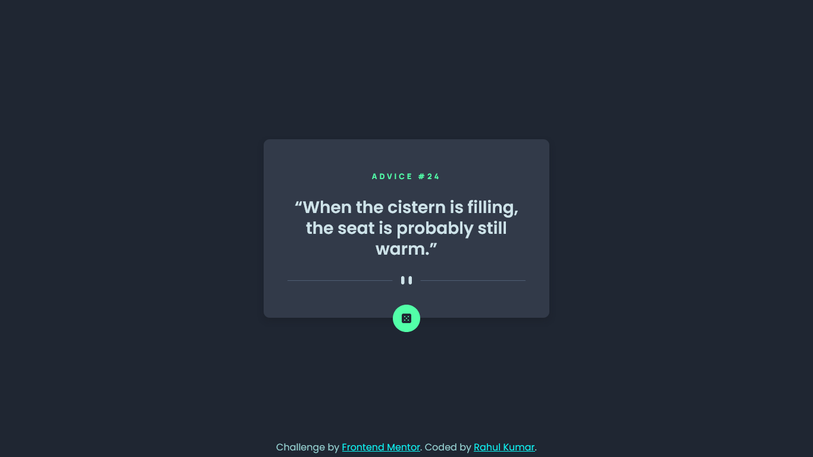

# Frontend Mentor - Advice generator app solution

This is a solution to the [Advice generator app challenge on Frontend Mentor](https://www.frontendmentor.io/challenges/advice-generator-app-QdUG-13db). Frontend Mentor challenges help you improve your coding skills by building realistic projects.

## Table of contents

- [Overview](#overview)
  - [Screenshot](#screenshot)
  - [Links](#links)
- [My process](#my-process)
  - [Built with](#built-with)
  - [Useful resources](#useful-resources)
- [Author](#author)

## Overview

### Screenshot

### Links

- Solution URL: [Github Repo](https://github.com/Rahulbaran/Frontend_Mentor_Challenges/tree/master/advice-generator)
- Live Site URL: [Advice Generator](https://frontendadviceapp.netlify.app/)

## My process

### Built with

- Semantic HTML5 markup
- CSS custom properties
- Flexbox
- Mobile-first workflow
- PostCSS
- pnpm package manager

### Useful resources

- [Netliy](https://app.netlify.com) - Netlify made it quite easier to deploy my app just by dragging and dropping the folder.
- [PostCSS](https://postcss.org/) - I was able to use some modern CSS properties with the help of PostCSS.

## Author

- Website - [Rahulbaran](https://github.com/Rahulbaran/Frontend_Mentor_Challenges)
- Frontend Mentor - [@Rahubaran](https://www.frontendmentor.io/profile/Rahulbaran)
- Twitter - [@rahul9422dev](https://www.twitter.com/rahul9422dev)
